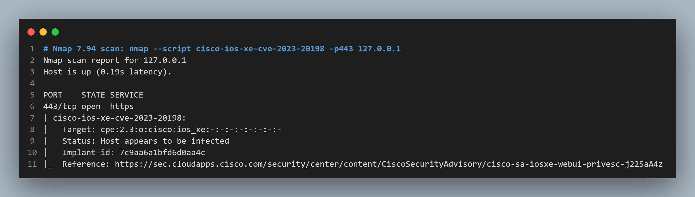
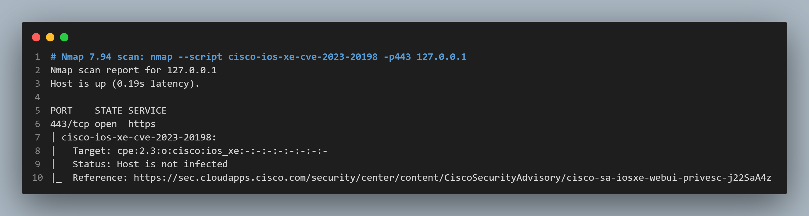
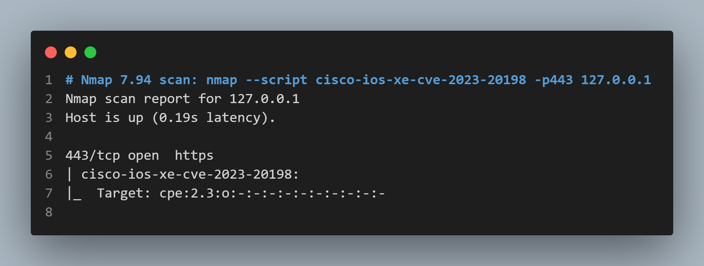

# CVE-2023-20198 Cisco IOS XE Vulnerability NSE Script for Nmap
This Nmap NSE script checks the target for the presence of the implant to CVE-2023-20198

## Usage
To use this script, run the following command:

```shell
Single Host
nmap --script cisco-ios-xe-cve-2023-20198 -p <port> <host>

Multiple Hosts from file
nmap --script cisco-ios-xe-cve-2023-20198 -p <port> -iL <list_host>

```

## Queries to find Cisco IOS XE systems
```
Censys query
labels: `cisco-xe-webui`

```

## Output

target is implanted



Target is not implanted



Target is not Cisco IOS XE




## References
https://sec.cloudapps.cisco.com/security/center/content/CiscoSecurityAdvisory/cisco-sa-iosxe-webui-privesc-j22SaA4z
https://blog.talosintelligence.com/active-exploitation-of-cisco-ios-xe-software
